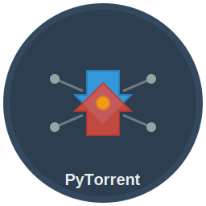

# PyTorrent - Standalone BitTorrent Client

**A modern, feature-rich BitTorrent client built with Python and Qt5**

## 🚀 Features

### Core Functionality
- ✅ **Torrent Files & Magnet Links** - Support for both .torrent files and magnet: links
- ✅ **Visual Progress Bars** - Beautiful colored progress indicators
- ✅ **Resume Downloads** - Continue where you left off after restart
- ✅ **Selective Downloads** - Choose which files to download from multi-file torrents
- ✅ **Real-time Statistics** - Live download/upload speeds, ETA, and ratios

### User Interface
- 🎨 **Modern GUI** - Clean, intuitive interface with progress bars
- 🔄 **System Tray Integration** - Minimize to tray, quick access menu
- 📋 **Context Menus** - Right-click for pause, resume, remove, open folder
- 📁 **Drag & Drop** - Drop torrent files or magnet links anywhere
- 🔔 **Toast Notifications** - Get notified when downloads complete

### Advanced Features
- ⚙️ **Comprehensive Settings** - Bandwidth limits, connection settings, ports
- 🌐 **DHT & Peer Discovery** - Distributed Hash Table and Local Service Discovery
- 📊 **Detailed Information** - Peer counts, seeds, ratios, and more
- 💾 **Session Persistence** - Your torrents are remembered between sessions

## 📥 Installation

### Windows
1. Download `PyTorrent.exe`
2. Double-click to run
3. Windows may show a security warning - click "More info" then "Run anyway"
4. Create desktop shortcut or pin to taskbar if desired

### macOS
1. Download `PyTorrent.app`
2. Drag to Applications folder
3. Right-click and select "Open" the first time (Gatekeeper security)
4. The app will be available in Launchpad

### Linux
1. Download `PyTorrent`
2. Make executable: `chmod +x PyTorrent`
3. Run with: `./PyTorrent`
4. Optionally create desktop entry or symlink to `/usr/local/bin`

## 🎯 Quick Start

1. **Add a Torrent**:
   - Click "Add Torrent" button or drag & drop a .torrent file
   - Or click "Add Magnet" and paste a magnet link
   - Or simply drag & drop a magnet link from your browser

2. **Select Files** (multi-file torrents):
   - Choose which files you want to download
   - Click "Select All" or "Select None" for convenience

3. **Monitor Progress**:
   - Watch the visual progress bars fill up
   - Check download/upload speeds in real-time
   - View detailed information in the bottom panel

4. **Control Downloads**:
   - Right-click torrents for pause/resume/remove options
   - Use the toolbar buttons for selected torrents
   - Open download folders directly from context menu

5. **System Tray**:
   - Close window to minimize to system tray
   - Double-click tray icon to restore window
   - Right-click tray icon for quick actions

## ⚙️ Configuration

Access preferences via **Tools → Preferences**:

- **General**: Startup behavior, confirmations
- **Downloads**: Default paths, completion handling
- **Connection**: Port settings, DHT, UPnP, connection limits
- **Bandwidth**: Upload/download rate limiting

## 🔧 Troubleshooting

### Common Issues

**"Application can't be opened" (macOS)**
- Right-click the app and select "Open"
- Go to System Preferences → Security & Privacy → Allow

**"Windows protected your PC" (Windows)**
- Click "More info" → "Run anyway"
- The app is safe but unsigned

**Permission denied (Linux)**
- Make sure the file is executable: `chmod +x PyTorrent`
- Check if you have write permissions to the download directory

**Poor download speeds**
- Check bandwidth limits in Preferences
- Enable UPnP in Connection settings
- Try different ports if blocked by ISP

**Downloads not resuming**
- Make sure the original torrent files haven't been moved
- Check that the download directory is accessible
- Verify sufficient disk space

## 🏗️ Technical Details

**Built with:**
- Python 3.7+
- PyQt5 for GUI
- libtorrent for BitTorrent protocol
- Packaged with PyInstaller

**System Requirements:**
- Windows 10+ / macOS 10.14+ / Linux (most distributions)
- 100MB free disk space
- Internet connection

## 📜 License

This project is licensed under the MIT License.

## 🤝 Contributing

PyTorrent is open source! Contributions welcome.

## ⚠️ Legal Notice

This software is for downloading legal content only. Please respect copyright laws and only download content you have permission to access.

---

**Enjoy fast, reliable torrenting with PyTorrent!** 🎉