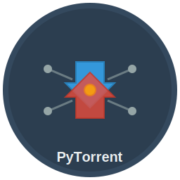

# 🚀 PyTorrent - Modern BitTorrent Client


A modern, feature-rich BitTorrent client built with Python and Qt5, providing a clean and intuitive interface for downloading and managing torrents.



## ✨ Features

### 🎨 **Modern Interface**
- **Visual Progress Bars** - Colored progress indicators (blue=downloading, green=seeding, gray=paused)
- **Real-time Statistics** - Live download/upload speeds, ETA, peer counts, ratios
- **Clean Qt5 Design** - Professional, intuitive user interface

### 🔄 **System Integration**
- **System Tray Support** - Minimize to tray with quick access menu
- **Toast Notifications** - Desktop alerts when downloads complete
- **Drag & Drop** - Drop .torrent files or magnet links anywhere
- **Context Menus** - Right-click torrents for quick actions

### 💪 **Powerful Functionality**
- **Resume Downloads** - Continue interrupted downloads after restart
- **File Selection** - Choose specific files from multi-file torrents
- **Bandwidth Control** - Upload/download rate limiting
- **Session Persistence** - Remember torrents between app restarts
- **DHT & UPnP Support** - Automatic peer discovery and port forwarding

### 🛠️ **Reliability**
- **Error Handling** - User-friendly error messages and recovery
- **libtorrent Backend** - Uses the proven libtorrent library
- **Cross-platform** - Works on macOS, Windows, and Linux
- **Memory Efficient** - Optimized for long-running sessions

## 📥 Installation

### Option 1: Download Standalone App (Recommended)
**[📦 Download Latest Release](https://github.com/ymode/pytorrent/releases/latest)**

- **macOS**: Download and drag `PyTorrent.app` to Applications folder
- **Windows**: Download and run `PyTorrent.exe` (coming soon)
- **Linux**: Download and run `PyTorrent` executable (coming soon)

### Option 2: Run from Source
```bash
# Clone the repository
git clone https://github.com/ymode/pytorrent.git
cd pytorrent

# Install dependencies
pip install -r requirements.txt

# Run the application
python main.py
```

## 🚀 Quick Start

1. **Add Torrents**: Click "Add Torrent" or drag .torrent files into the window
2. **Add Magnets**: Click "Add Magnet" or paste magnet links
3. **Select Files**: Choose which files to download from multi-file torrents
4. **Monitor Progress**: Watch visual progress bars and real-time statistics
5. **System Tray**: Close to minimize to tray, double-click to restore

## ⚙️ Configuration

Access preferences via **Tools → Preferences**:

- **General**: Startup behavior, confirmations
- **Downloads**: Default paths, completion handling  
- **Connection**: Port settings, DHT, UPnP, connection limits
- **Bandwidth**: Upload/download rate limiting

## 🏗️ Building from Source

### Requirements
- Python 3.7+
- PyQt5 5.15+
- libtorrent 2.0+
- PyInstaller (for building executables)

### Build Standalone Executable
```bash
# Install build dependencies
pip install -r requirements-build.txt

# Run the build script
python build.py
```

This creates a standalone executable in the `release/` folder.

## 🐛 Troubleshooting

### Common Issues

**macOS: "App can't be opened"**
- Right-click app → "Open" → "Open" (bypasses Gatekeeper)

**Windows: "Windows protected your PC"**  
- Click "More info" → "Run anyway"

**Poor Download Speeds**
- Check bandwidth limits in Preferences
- Enable UPnP and DHT in Connection settings
- Verify firewall/router settings

**Downloads Not Resuming**
- Ensure torrent files haven't been moved
- Check download directory permissions
- Verify sufficient disk space

## 🤝 Contributing

We welcome contributions! Here's how to help:

1. **Fork** the repository
2. **Create** a feature branch (`git checkout -b feature/amazing-feature`)
3. **Commit** your changes (`git commit -m 'Add amazing feature'`)
4. **Push** to the branch (`git push origin feature/amazing-feature`)
5. **Open** a Pull Request

### Development Setup
```bash
git clone https://github.com/ymode/pytorrent.git
cd pytorrent
pip install -r requirements.txt
python main.py
```

## 📋 Roadmap

### v1.0 (Coming Soon)
- [ ] Windows executable release
- [ ] Linux AppImage release
- [ ] Built-in torrent search
- [ ] RSS feed support

### v1.1 (Future)
- [ ] Dark mode theme
- [ ] Statistics dashboard
- [ ] Plugin system
- [ ] Web interface for remote management

## 📄 License

This project is licensed under the MIT License - see the [LICENSE](LICENSE) file for details.

## ⚠️ Legal Notice

This software is for downloading legal content only. Please respect copyright laws and only download content you have permission to access.

## 🙏 Acknowledgments

- **libtorrent** team for the excellent BitTorrent library
- **Qt/PyQt** developers for the robust GUI framework
- **PyInstaller** team for making distribution easy
- BitTorrent community for protocol development

## 📊 Stats


---

**Made with ❤️ for the open source community**

*Star ⭐ this repo if you find it useful!*
